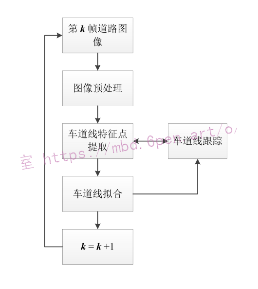
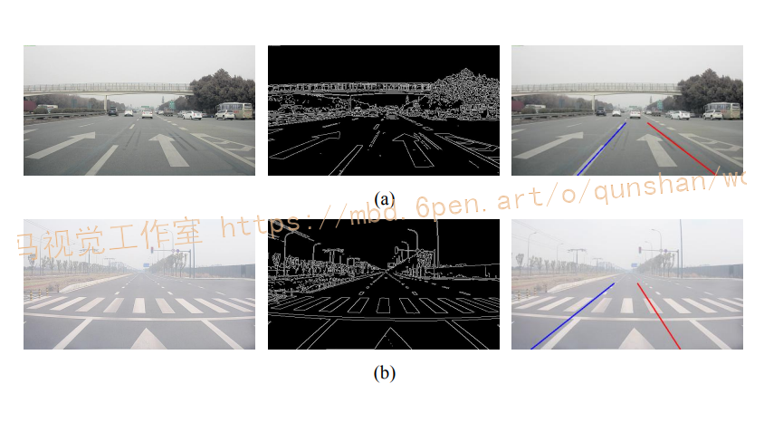

# 1.研究背景
汽车主动安全系统能够实现风险的主动预防和规避，其能有力缓解当前我国汽车交通事故频发的困境，故对其的相关研究得到了国家的大力支持。
车道保持辅助系统（LKAS，Lane Keeping Assistance Systems）作为ADAS中的一种，它能够有效地避免因车辆偏离正常行驶车道而引发的交通事故。有关专家表示，由车道偏离造成的事故占全球汽车交通事故总量的50%左右，因此围绕LKAS展开的相关研究也应受到行业和学术界的重点关注。同时，以摄像头作为LKAS的主要环境感知传感器将有效降低系统的研发及生产成本,进而快速提高系统的普及率和装配率。基于上述原因，研究以摄像头为主传感器的基于机器视觉的车道保持辅助系统具有重要的现实意义。

# 2.图片演示


# 3.视频演示
[基于OpenCV的实时车道线分割＆车道保持系统（源码＆教程）_哔哩哔哩_bilibili](https://www.bilibili.com/video/BV1314y137Me/?vd_source=bc9aec86d164b67a7004b996143742dc)

# 4.算法流程图
[参考该博客提出的算法流程，稍加改进，](https://afdian.net/item?plan_id=0402ae1a8f2b11eda3545254001e7c00)在基于机器视觉的车道保持辅助系统中，系统将通过车道线识别与跟踪模块来提取准确的道路图像信息，进而根据它们反解出道路空间信息以及车辆相对于车道的位姿信息等以供后续模块的使用。在本章中，本文将基于图所示的车道线识别流程研究设计一种高效、稳定的车道线识别与跟踪算法。

(1)图像预处理:对原始道路图像进行处理，获得噪声较少的车道线特征图。
(2)车道线特征点提取:从车道线特征图中提取出车道线特征点。
(3)车道线拟合:选取适当的数学模型，根据车道线特征点拟合出车道线。
(4)车道线跟踪:选择合适的跟踪对象并设计相应的跟踪策略，以提高车道线识别的稳定性及准确率。

# 5.图像预处理
在原始的道路图像中，存在大量无用的信息以及干扰点。对图像进行预处理，可以有效地减少算法需要处理的数据量，同时筛除图像中的大部分噪声，从而起到降低车道线识别算法整体开发难度、提高算法整体运行效率的作用。
图像特征提取是图像预处理的必要环节，它将决定整个车道线识别算法的基本设计思路，故图像预处理工作必须紧密地围绕其来展开。通过对比分析现有特征提取手段的优缺点，本文最终选取基于车道线宽度特征的线性滤波来进行图像特征提取，并围绕其设计了一套图像预处理方法，如图是该方法的工作流程，其中涉及的图像预处理手段依次为图像灰度化、图像特征提取、图像二值化、逆透视变换以及感兴趣区域获取。


# 6.车道线边缘检测
车道线边缘检测是车道线识别领域中应用最为广泛的图像特征提取手段。在灰度图像中，灰度值存在显著变化的像素点被称为边缘像素点。通常情况下，车道线与道路交界处的像素点也会发生灰度值的突变，即在车道线的边界处存在属于车道线的边缘像素点。因此，算法可以通过边缘检测来提取图像中属于车道线的边缘像素点，进而根据它们来实现对车道线的识别与定位。
在图像处理领域中，常采用Canny边缘检测算法进行边缘检测。如图，经过边缘检测后，原始图像将转化为如图(b)所示的边缘图像。对比图(a)和(b)可知，在边缘图像中，仅有的物体的边缘像素点得到了保留。


然而，边缘检测将使图像丢失大量重要的车道线信息，如车道线的几何信息、灰度值信息等。这就导致基于边缘检测开发的车道线识别算法的错检率普遍较高。如图，展示了这类算法在某些常见环境下发生的车道线错检。由图可知，当非车道线边缘与车道线边缘相互平行时，由于缺乏其他信息，算法将无法有效地区分二者，所以算法将很有可能发生错检。


另外，仅根据车道线的边缘像素点将很难实现对弯道车道线的识别，同时，现有的边缘检测算法检测耗时普遍较长，实时性差，因此本文最终决定不采用边缘检测进行图像特征提取。

# 7.基于车道线宽度特征的线性滤波
在真实道路图像中，由于车道线像素点之间灰度值相近，而路面上非车道线像素点之间灰度值也相近，且前者的灰度值普遍大于后者，因此对真实道路图像进行线性滤波后，也将获得如图所示的“明-暗”分布效果。
如图，展示了对真实道路图像进行线性滤波后的效果。由图(b)可知，经过滤波后，车道线像素点与路面非车道线像素点在视觉层面上被明显地区分开了，同时车道线的宽度、长度、大致形状等信息也得到了保留。

另外，基于车道线宽度特征的线性滤波能够排除以下一些干扰源对车道线识别算法带来的干扰。
(1)斑马线等宽度超过车道线的白色标志线。
(2)路面黑色刹车印或水迹等。
(3)路边台阶。
如图，展示了包含上述干扰源的道路图像经过线性滤波后的效果，为了方便观察，本文还对滤波后的图像进行了二值化处理。显然，经过滤波后，大多数前述干扰源的像素点都变“暗”，即被过滤掉了。


# 8.逆透视变换
摄像头成像是一个透视过程，它会使地面上相互平行的车道线在图像中相交于一点。逆透视变换的目的就是去除上述透视效应，使图像中相交的车道线重新回到相互平行的状态。当已知摄像头的内外参数时，[该博客提出的算法便能够对原始图像进行逆透视变换](https://mbd.pub/o/bread/Y56TmZZt)，并获得逆透视图像。逆透视变换的过程如下:

如图展示了本文的二值化特征图经过逆透视变换后的效果。显然，经过逆透视变换后，图中不平行的车道线重新回到了如图所示的相互平行的状态。在后文中，方便起见，本文称经过逆透视变换后的二值化特征图为“逆透视特征图”。


# 9.车道线拟合
在基于机器视觉的车道保持辅助系统中，车道线识别与跟踪模块的输出是参数确定的车道线数学模型，而车道偏离预警模块和车道保持控制模块都将根据该模型来获取相应的车路信息，故模型合理、参数精确的车道线数学模型是保证车道线识别与跟踪算法高性能运行的关键。基于此，车道线拟合阶段的工作即是选取适当的车道线数学模型，并利用已搜索到的车道线特征点来确定该模型的各个参数。
在拟合车道线模型时，常用的方法有随机抽样一致性算法和最小二乘算法这两种。随机抽样一致性算法不易受噪声点影响，但其需要进行迭代计算，循环次数多，处理速度慢。最小二乘算法的处理速度较快，但其易受噪声点干扰。在本文中，通过提取得到的车道线特征点中将没有噪声点或只存在极少数的噪声点，故使用最小二乘算法即能获得高精度的模型参数，又能保证算法的运算效率。因此，本文决定采用最小二乘算法来进行车道线模型拟合。
对于一个参数未定的数学模型，最小二乘算法通过最小化该模型与已知数据点的误差平方和来寻找最佳的模型参数。


求解线性方程组，得到参数a、b和c的确定值，从而完成对二次曲线模型C:x = ay'+by+c的拟合。
如图，是算法对不同类型车道线的拟合结果。由图可知，二次曲线模型已经能够很好的拟合车道线。


# 10.车道线跟踪
一般地，对于连续相邻多帧的车道线特征图，车道线在图像中的起点、整体位置、大致形状等变化微小。基于上述事实，在车道线识别算法中选取合适的跟踪对象，并设计合理的跟踪策略，将有助于提高算法的识别准确率和成功率，同时降低算法的错检率和漏检率。
本文采取的车道线跟踪策略如下:
(1)利用第k-1帧特征图的车道线起点来指导第k帧特征图的车道线起点的检测。
(2)利用第k-1帧特征图的车道线参数模型来指导第k帧特征图的车道线特征点提取。
(3)若未能从第k帧特征图中成功识别出车道线，则按以下方式进行处理。
a.若第k-1帧的车道线参数模型存在，且其不是从第k-2帧继承而来的，则令第k帧继承第k-1帧的车道线参数模型。其中，“继承”是指直接令某一帧图像的车道线检测结果与另一帧的车道线检测结果相同。
b.若第k-1帧的车道线参数模型存在，且其是从第k-2帧继承而来的，则第k帧不继承第k-1帧的车道线参数模型。
c.若第k-1帧的车道线参数模型不存在，则第k帧的车道线参数模型也不存在。

# 11.核心代码实现
```
# Canny检测
def do_canny(frame):
	# 将每一帧转化为灰度图像，去除多余信息
	gray = cv.cvtColor(frame,cv.COLOR_BGR2GRAY)
	# 高斯滤波器，去除噪声，平滑图像
	blur = cv.GaussianBlur(gray,(5,5),0)
	# 边缘检测
	# minVal = 50
	# maxVal = 150
	canny = cv.Canny(blur,50,150)

	return canny

# 图像分割，去除多余线条信息
def do_segment(frame):
	# 获取图像高度(注意CV的坐标系,正方形左上为0点，→和↓分别为x,y正方向)
	height = frame.shape[0]

	# 创建一个三角形的区域,指定三点
	polygons = np.array([
		[(0,height), 
		 (800,height),
		 (380,290)]
		])

	# 创建一个mask,形状与frame相同，全为0值
	mask = np.zeros_like(frame)

	# 对该mask进行填充，做一个掩码
	# 三角形区域为1
	# 其余为0
	cv.fillPoly(mask,polygons,255) 

	# 将frame与mask做与，抠取需要区域
	segment = cv.bitwise_and(frame,mask) 

	return segment

# 车道左右边界标定
def calculate_lines(frame,lines):
	# 建立两个空列表，用于存储左右车道边界坐标
	left = []
	right = []

	# 循环遍历lines
	for line in lines:
		# 将线段信息从二维转化能到一维
		x1,y1,x2,y2 = line.reshape(4)

		# 将一个线性多项式拟合到x和y坐标上，并返回一个描述斜率和y轴截距的系数向量
		parameters = np.polyfit((x1,x2), (y1,y2), 1)
		slope = parameters[0] #斜率 
		y_intercept = parameters[1] #截距

		# 通过斜率大小，可以判断是左边界还是右边界
		# 很明显左边界slope<0(注意cv坐标系不同的)
		# 右边界slope>0
		if slope < 0:
			left.append((slope,y_intercept))
		else:
			right.append((slope,y_intercept))

	# 将所有左边界和右边界做平均，得到一条直线的斜率和截距
	left_avg = np.average(left,axis=0)
	right_avg = np.average(right,axis=0)
	# 将这个截距和斜率值转换为x1,y1,x2,y2
	left_line = calculate_coordinate(frame,parameters=left_avg)
	right_line = calculate_coordinate(frame, parameters=right_avg)

	return np.array([left_line,right_line])

# 将截距与斜率转换为cv空间坐标
def calculate_coordinate(frame,parameters):
	# 获取斜率与截距
	slope, y_intercept = parameters

	# 设置初始y坐标为自顶向下(框架底部)的高度
	# 将最终的y坐标设置为框架底部上方150
	y1 = frame.shape[0]
	y2 = int(y1-150)
	# 根据y1=kx1+b,y2=kx2+b求取x1,x2
	x1 = int((y1-y_intercept)/slope)
	x2 = int((y2-y_intercept)/slope)
	return np.array([x1,y1,x2,y2])

# 可视化车道线
def visualize_lines(frame,lines):
	lines_visualize = np.zeros_like(frame)
	# 检测lines是否为空
	if lines is not None:
		for x1,y1,x2,y2 in lines:
			# 画线
			cv.line(lines_visualize,(x1,y1),(x2,y2),(0,0,255),5)
	return lines_visualize

......
```

# 12.系统整合
下图[完整源码＆环境部署视频教程＆自定义UI界面](https://s.xiaocichang.com/s/0b5d75)：

参考博客[《基于OpenCV的实时车道线分割＆车道保持系统（源码＆教程）》](https://mbd.pub/o/qunma/work)

# 13.参考文献
***
[1][朱思聪](https://s.wanfangdata.com.cn/paper?q=%E4%BD%9C%E8%80%85:%22%E6%9C%B1%E6%80%9D%E8%81%AA%22),[周德龙](https://s.wanfangdata.com.cn/paper?q=%E4%BD%9C%E8%80%85:%22%E5%91%A8%E5%BE%B7%E9%BE%99%22).[角点检测技术综述](https://d.wanfangdata.com.cn/periodical/jsjxtyy202001004)[J].[计算机系统应用](https://sns.wanfangdata.com.cn/perio/jsjxtyy).2020,(1).DOI:[10.15888/j.cnki.csa.007237](http://dx.chinadoi.cn/10.15888/j.cnki.csa.007237).

[2][胡延平](https://s.wanfangdata.com.cn/paper?q=%E4%BD%9C%E8%80%85:%22%E8%83%A1%E5%BB%B6%E5%B9%B3%22),[唐叩祝](https://s.wanfangdata.com.cn/paper?q=%E4%BD%9C%E8%80%85:%22%E5%94%90%E5%8F%A9%E7%A5%9D%22),[王乃汉](https://s.wanfangdata.com.cn/paper?q=%E4%BD%9C%E8%80%85:%22%E7%8E%8B%E4%B9%83%E6%B1%89%22).[基于粒子群优化神经网络PID控制的车道保持系统研究](https://d.wanfangdata.com.cn/periodical/bjqc201804010)[J].[北京汽车](https://sns.wanfangdata.com.cn/perio/bjqc).2018,(4).DOI:[10.14175/j.issn.1002-4581.2018.04.010](http://dx.chinadoi.cn/10.14175/j.issn.1002-4581.2018.04.010).

[3][郭克友](https://s.wanfangdata.com.cn/paper?q=%E4%BD%9C%E8%80%85:%22%E9%83%AD%E5%85%8B%E5%8F%8B%22),[王艺伟](https://s.wanfangdata.com.cn/paper?q=%E4%BD%9C%E8%80%85:%22%E7%8E%8B%E8%89%BA%E4%BC%9F%22),[郭晓丽](https://s.wanfangdata.com.cn/paper?q=%E4%BD%9C%E8%80%85:%22%E9%83%AD%E6%99%93%E4%B8%BD%22).[LDA与LSD相结合的车道线分类检测算法](https://d.wanfangdata.com.cn/periodical/jsjgcyyy201724036)[J].[计算机工程与应用](https://sns.wanfangdata.com.cn/perio/jsjgcyyy).2017,(24).DOI:[10.3778/j.issn.1002-8331.1606-0116](http://dx.chinadoi.cn/10.3778/j.issn.1002-8331.1606-0116).

[4][陈无畏](https://s.wanfangdata.com.cn/paper?q=%E4%BD%9C%E8%80%85:%22%E9%99%88%E6%97%A0%E7%95%8F%22),[谈东奎](https://s.wanfangdata.com.cn/paper?q=%E4%BD%9C%E8%80%85:%22%E8%B0%88%E4%B8%9C%E5%A5%8E%22),[汪洪波](https://s.wanfangdata.com.cn/paper?q=%E4%BD%9C%E8%80%85:%22%E6%B1%AA%E6%B4%AA%E6%B3%A2%22),等.[一类基于轨迹预测的驾驶员方向控制模型](https://d.wanfangdata.com.cn/periodical/jxgcxb201614012)[J].[机械工程学报](https://sns.wanfangdata.com.cn/perio/jxgcxb).2016,(14).DOI:[10.3901/JME.2016.14.106](http://dx.chinadoi.cn/10.3901/JME.2016.14.106).

[5][曹晴晴](https://s.wanfangdata.com.cn/paper?q=%E4%BD%9C%E8%80%85:%22%E6%9B%B9%E6%99%B4%E6%99%B4%22),[丁志中](https://s.wanfangdata.com.cn/paper?q=%E4%BD%9C%E8%80%85:%22%E4%B8%81%E5%BF%97%E4%B8%AD%22).[基于二自由度的车辆AFS系统建模与仿真](https://d.wanfangdata.com.cn/periodical/dzclyyqxb201404015)[J].[电子测量与仪器学报](https://sns.wanfangdata.com.cn/perio/dzclyyqxb).2014,(4).DOI:[10.13382/j.jemi.2014.04.015](http://dx.chinadoi.cn/10.13382/j.jemi.2014.04.015).

[6][徐瑾](https://s.wanfangdata.com.cn/paper?q=%E4%BD%9C%E8%80%85:%22%E5%BE%90%E7%91%BE%22),[赵又群](https://s.wanfangdata.com.cn/paper?q=%E4%BD%9C%E8%80%85:%22%E8%B5%B5%E5%8F%88%E7%BE%A4%22),[阮米庆](https://s.wanfangdata.com.cn/paper?q=%E4%BD%9C%E8%80%85:%22%E9%98%AE%E7%B1%B3%E5%BA%86%22).[基于汽车操纵动力学的神经网络驾驶员模型](https://d.wanfangdata.com.cn/periodical/dlxykzxb200804018)[J].[动力学与控制学报](https://sns.wanfangdata.com.cn/perio/dlxykzxb).2008,(4).DOI:[10.3969/j.issn.1672-6553.2008.04.018](http://dx.chinadoi.cn/10.3969/j.issn.1672-6553.2008.04.018).

[7][伍明](https://s.wanfangdata.com.cn/paper?q=%E4%BD%9C%E8%80%85:%22%E4%BC%8D%E6%98%8E%22),[伍俊龙](https://s.wanfangdata.com.cn/paper?q=%E4%BD%9C%E8%80%85:%22%E4%BC%8D%E4%BF%8A%E9%BE%99%22),[马帅](https://s.wanfangdata.com.cn/paper?q=%E4%BD%9C%E8%80%85:%22%E9%A9%AC%E5%B8%85%22),等.基于角点灰度分布特征的棋盘格角点检测[J].[激光与光电子学进展](https://sns.wanfangdata.com.cn/perio/jgygdzxjz).2020,(1).DOI:[10.3788/LOP57.011204](http://dx.doi.org/10.3788/LOP57.011204).

[8][王沛然](https://s.wanfangdata.com.cn/paper?q=%E4%BD%9C%E8%80%85:%22%E7%8E%8B%E6%B2%9B%E7%84%B6%22),[常连玉](https://s.wanfangdata.com.cn/paper?q=%E4%BD%9C%E8%80%85:%22%E5%B8%B8%E8%BF%9E%E7%8E%89%22).[基于改进驾驶员模型的车道保持控制模型](https://d.wanfangdata.com.cn/periodical/zgaqkxxb201807003)[J].[中国安全科学学报](https://sns.wanfangdata.com.cn/perio/zgaqkxxb).2018,(7).DOI:[10.16265/j.cnki.issn1003-3033.2018.07.003](http://dx.chinadoi.cn/10.16265/j.cnki.issn1003-3033.2018.07.003).

[9][罗莉华](https://s.wanfangdata.com.cn/paper?q=%E4%BD%9C%E8%80%85:%22%E7%BD%97%E8%8E%89%E5%8D%8E%22).[基于MPC的车道保持系统转向控制策略](https://d.wanfangdata.com.cn/periodical/shjtdxxb201407021)[J].[上海交通大学学报](https://sns.wanfangdata.com.cn/perio/shjtdxxb).2014,(7).

[10][李海丰](https://s.wanfangdata.com.cn/paper?q=%E4%BD%9C%E8%80%85:%22%E6%9D%8E%E6%B5%B7%E4%B8%B0%22),[刘景泰](https://s.wanfangdata.com.cn/paper?q=%E4%BD%9C%E8%80%85:%22%E5%88%98%E6%99%AF%E6%B3%B0%22).[一种优化的消失点估计方法及误差分析](https://d.wanfangdata.com.cn/periodical/zdhxb201202007)[J].[自动化学报](https://sns.wanfangdata.com.cn/perio/zdhxb).2012,(2).DOI:[10.3724/SP.J.1004.2012.00213](http://dx.chinadoi.cn/10.3724/SP.J.1004.2012.00213).


---
#### 如果您需要更详细的【源码和环境部署教程】，除了通过【系统整合】小节的链接获取之外，还可以通过邮箱以下途径获取:
#### 1.请先在GitHub上为该项目点赞（Star），编辑一封邮件，附上点赞的截图、项目的中文描述概述（About）以及您的用途需求，发送到我们的邮箱
#### sharecode@yeah.net
#### 2.我们收到邮件后会定期根据邮件的接收顺序将【完整源码和环境部署教程】发送到您的邮箱。
#### 【免责声明】本文来源于用户投稿，如果侵犯任何第三方的合法权益，可通过邮箱联系删除。